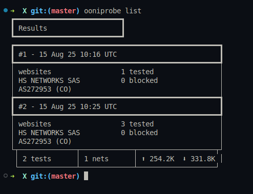

# Guía de uso de OONI desde la terminal

La **Open Observatory of Network Interference (OONI)** es una herramienta de código abierto que permite detectar **censura, manipulación o interferencias** en Internet mediante pruebas técnicas distribuidas.
El uso desde la terminal (*CLI*) brinda flexibilidad y control total para ejecutar pruebas específicas.

---

## Probar sitios web

Tras ejecutar el script de instalación [`install-ooni.sh`](../scripts/install-ooni.sh "Script de instalación de OONI"), puede realizar una prueba sobre un sitio web concreto con el comando:

```bash
ooniprobe run websites --input https://sitioweb.com
```

Para probar un sitio Web específico.

### Probar múltiples sitios web

Si desea evaluar varios dominios en una sola ejecución, prepare un archivo de texto (por ejemplo, `websites-example.txt`) con un dominio por línea, y ejecute:

```bash
ooniprobe run websites --input-file websites-example.txt
```

La estructura del archivo de texto, como por ejemplo `websites-example.txt` debe tener esta estructura:

```bash
https://sitioweb1.com
https://sitioweb2.com
https://sitioweb3.com
...
https://sitiowebN.com
```

**Nota técnica:**

* OONI utiliza diferentes métodos de verificación, como conexiones HTTP directas, DNS y mediciones TLS, para identificar si un sitio está bloqueado o manipulado.
* Los resultados incluyen indicadores como tiempo de respuesta, códigos HTTP y evidencia de filtrado.

## Consultar pruebas realizadas

Después de ejecutar varias pruebas o experimentos, puede listar los resultados disponibles en el sistema local con:

```bash
ooniprobe list
```

Esto generará un listado similar a la siguiente captura, donde cada entrada incluye la fecha, el tipo de prueba y un identificador único:



---

## Ampliar información y opciones avanzadas

Para obtener una lista completa de parámetros, opciones de filtrado y formatos de exportación, consulte la **documentación oficial** en:
[ooni.org/support/ooni-probe-cli/](https://ooni.org/support/ooni-probe-cli/ "Guía de uso - Web Oficial")
